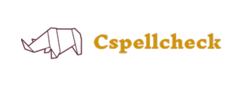

# *[Under Development]*

# CpellCheck
 
 

    
 

 
## Resources
* [Stanford - Spelling Correction and the Noisy Channel](https://web.stanford.edu/~jurafsky/slp3/B.pdf)
* [Detection is the central problem in real-word spelling correction](https://arxiv.org/pdf/1408.3153.pdf)

### To do list
* [ ]  Bringing a usable structure with data change for different languages.
* [ ]  Developing the optimized code in C++ for the Python interface.
* [ ]  Published as a library
